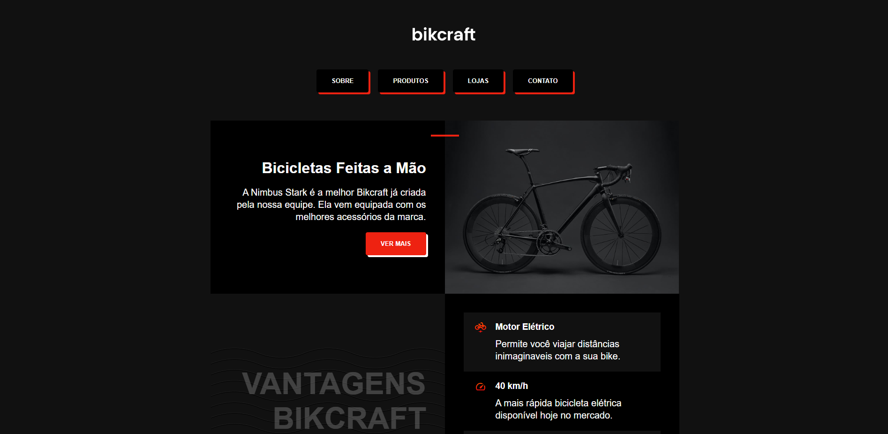

# Bikcraft

> HTML e CSS para Iniciantes 

Projeto construído no curso HTML e CSS para Iniciantes da Origamid.

[🔗 Clique aqui para acessar a página](https://ronald-ca.github.io/bikcraft.github.io/)

## 📌 Tecnologias

- HTML
- CSS
- Git e GitHub

## 📫 Contato

ronaldcamargodev@gmail.com
